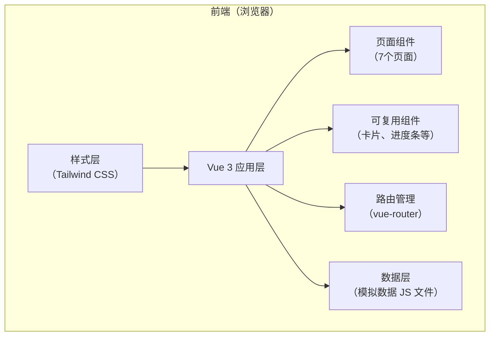
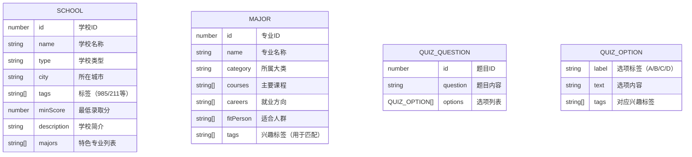

# 高考志愿填报助手 — 技术架构文档

## 1. 架构设计

本项目为纯前端单页应用（SPA），无需后端服务，所有数据内置在前端代码中。



## 2. 技术描述

* **前端框架**：Vue 3 + Vite

* **路由管理**：Vue Router 4

* **样式方案**：Tailwind CSS 3

* **开发语言**：TypeScript

* **数据方式**：内置模拟数据（纯前端 JS/TS 文件，无后端、无数据库）

* **初始化工具**：vite-init

* **包管理器**：npm（Windows 环境）

## 3. 路由定义

| 路由路径            | 页面组件         | 功能             |
| --------------- | ------------ | -------------- |
| `/`             | Home         | 首页，功能入口导航      |
| `/find-school`  | FindSchool   | 找学校页，输入分数、展示推荐 |
| `/school/:id`   | SchoolDetail | 学校详情页          |
| `/choose-major` | ChooseMajor  | 选专业页，分类浏览+测试入口 |
| `/major/:id`    | MajorDetail  | 专业详情页          |
| `/quiz`         | QuizPage     | 兴趣测试页，逐题答题     |
| `/quiz/result`  | QuizResult   | 测试结果页，推荐专业     |

## 4. 数据模型

### 4.1 数据模型定义



### 4.2 数据文件

| 文件                          | 内容   | 数量   |
| --------------------------- | ---- | ---- |
| `src/data/schools.ts`       | 大学数据 | 25 所 |
| `src/data/majors.ts`        | 专业数据 | 25 个 |
| `src/data/quizQuestions.ts` | 测试题目 | 8 道  |

## 5. 项目文件结构

```
college_preference/
├── src/
│   ├── views/                     # 页面组件
│   │   ├── Home.vue               # 首页
│   │   ├── FindSchool.vue         # 找学校页
│   │   ├── SchoolDetail.vue       # 学校详情页
│   │   ├── ChooseMajor.vue        # 选专业页
│   │   ├── MajorDetail.vue        # 专业详情页
│   │   ├── QuizPage.vue           # 兴趣测试页
│   │   └── QuizResult.vue         # 测试结果页
│   ├── components/                # 可复用组件
│   │   ├── SchoolCard.vue         # 学校卡片
│   │   ├── MajorCard.vue          # 专业卡片
│   │   └── ProgressBar.vue        # 进度条
│   ├── data/                      # 模拟数据
│   │   ├── schools.ts             # 大学数据
│   │   ├── majors.ts              # 专业数据
│   │   └── quizQuestions.ts       # 测试题目
│   ├── composables/               # 可复用逻辑（Vue composables）
│   │   ├── useSchoolMatch.ts      # 学校匹配逻辑
│   │   └── useQuiz.ts             # 测试逻辑
│   ├── router/                    # 路由配置
│   │   └── index.ts
│   ├── types/                     # TypeScript 类型定义
│   │   └── index.ts
│   ├── App.vue                    # 根组件
│   ├── main.ts                    # 入口文件
│   └── style.css                  # 全局样式 + Tailwind
├── public/                        # 静态资源
├── index.html
├── package.json
├── vite.config.ts
├── tailwind.config.js
├── postcss.config.js
└── tsconfig.json
```

## 6. 核心算法

### 6.1 学校匹配算法

根据用户输入的分数，计算与每所学校的分差，分为三档：

* **冲刺档**：学校最低分 ≥ 用户分数，且分差 ≤ 20 分

* **稳妥档**：用户分数 > 学校最低分，且分差 ≤ 30 分

* **保底档**：用户分数 - 学校最低分 > 30 分

每档按匹配度排序（冲刺档按升序，稳妥/保底按降序），各取前 5-8 所展示。

### 6.2 兴趣测试匹配算法

1. 初始化 6 个兴趣标签得分：实践型、逻辑型、社交型、艺术型、研究型、管理型
2. 用户每选一个选项，对应标签 +1 分
3. 答完 8 题后，按得分降序排列标签
4. 取 Top 3 标签去专业库匹配
5. 每个专业的匹配度 = （专业拥有的匹配标签数 / 3）× 100%
6. 按匹配度降序，取 Top 3 专业展示

## 7. 开发阶段计划

### 第一阶段：项目基础 + 找学校模块

1. 初始化 Vue + Vite + Tailwind 项目
2. 配置路由
3. 定义 TypeScript 类型
4. 准备学校模拟数据
5. 实现首页
6. 实现学校卡片组件
7. 实现找学校页（输入 + 推荐结果）
8. 实现学校详情页

### 第二阶段：选专业 + 兴趣测试

1. 准备专业模拟数据
2. 实现专业卡片组件
3. 实现选专业页（分类浏览 + 测试入口）
4. 实现专业详情页
5. 准备测试题目数据
6. 实现进度条组件
7. 实现兴趣测试页（答题流程）
8. 实现测试结果页

### 第三阶段：优化完善

1. 全局样式优化和主题统一
2. 交互动效优化
3. 响应式适配
4. 代码质量检查和修复

