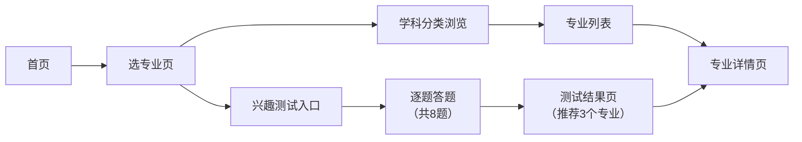

# 高考志愿填报助手 — 产品需求文档

## 1. 产品概述

高考志愿填报助手是一款面向高考考生和家长的网页应用，帮助用户快速匹配适合的大学、发现适合的专业。通过分数智能推荐和兴趣测试两大核心功能，降低志愿填报的信息门槛和决策难度。

* **核心价值**：让考生用最简单的方式找到"能上的大学"和"适合的专业"

* **目标用户**：高考考生、考生家长

* **使用场景**：高考出分后志愿填报阶段、考前专业探索阶段

## 2. 核心功能

### 2.1 用户角色

| 角色   | 注册方式      | 核心权限                 |
| ---- | --------- | -------------------- |
| 普通用户 | 无需注册，直接使用 | 浏览所有功能、使用分数匹配、进行兴趣测试 |

### 2.2 功能模块

1. **首页**：功能入口导航、品牌展示
2. **分数找学校**：输入分数 → 三档推荐（冲刺/稳妥/保底）→ 学校详情
3. **选专业**：学科分类浏览 → 专业详情；兴趣测试 → 推荐结果 → 专业详情

### 2.3 页面详情

| 页面名称  | 模块名称    | 功能描述                       |
| ----- | ------- | -------------------------- |
| 首页    | Hero 区域 | 展示产品名称、副标题、两个核心功能入口按钮      |
| 首页    | 底部信息    | 产品说明、使用提示                  |
| 找学校页  | 分数输入区   | 高考分数输入框（必填）、位次输入框（选填）、匹配按钮 |
| 找学校页  | 推荐结果区   | 分三档展示：冲刺院校、稳妥院校、保底院校       |
| 找学校页  | 学校卡片    | 展示校名、城市、类型、最低分，点击进入详情      |
| 学校详情页 | 基本信息    | 学校名称、类型、城市、标签              |
| 学校详情页 | 学校简介    | 学校详细介绍文字                   |
| 学校详情页 | 录取信息    | 近年最低录取分数                   |
| 学校详情页 | 特色专业    | 学校优势专业列表                   |
| 选专业页  | 测试入口    | 兴趣小测试大卡片入口                 |
| 选专业页  | 分类浏览    | 8大学科分类卡片，点击展开专业列表          |
| 选专业页  | 专业卡片    | 展示专业名称、所属大类，点击进入详情         |
| 专业详情页 | 基本信息    | 专业名称、所属大类、标签               |
| 专业详情页 | 学习内容    | 主要课程列表                     |
| 专业详情页 | 就业方向    | 毕业去向列表                     |
| 专业详情页 | 适合人群    | 适合该专业的人群特征                 |
| 兴趣测试页 | 进度展示    | 当前题号、总题数、进度条               |
| 兴趣测试页 | 答题区     | 题目、4个选项（单选）、下一题按钮          |
| 测试结果页 | 结果展示    | 推荐3个专业，按匹配度排序，显示匹配百分比      |
| 测试结果页 | 操作区     | 查看详情（跳转专业页）、再测一次按钮         |

## 3. 核心流程

### 3.1 分数找学校流程

用户从首页进入"找学校"页面，输入高考分数（可选填位次），点击"开始匹配"按钮，系统根据分数与学校最低录取分对比，将学校分为冲刺、稳妥、保底三档展示。用户点击任意学校卡片，进入学校详情页查看完整信息。

```HTML
flowchart LR
    A["首页"] --> B["找学校页"]
    B --> C["输入分数/位次"]
    C --> D["点击匹配按钮"]
    D --> E["展示三档结果<br/>（冲刺/稳妥/保底）"]
    E --> F["点击学校卡片"]
    F --> G["学校详情页"]
```

### 3.2 专业选择流程

用户从首页进入"选专业"页面，有两条路径：

* **路径一（浏览）**：点击学科分类卡片，展开该分类下的专业列表，点击专业卡片进入详情页。

* **路径二（测试）**：点击兴趣测试入口，逐题作答（共8题），答完后系统根据答案计算兴趣标签，推荐匹配度最高的3个专业，用户可跳转查看专业详情。



## 4. 用户界面设计

### 4.1 设计风格

**整体风格**：清新、专业、可信赖 — 面向学生和家长的教育类产品

* **主色调**：渐变蓝紫（从蓝色到紫色的渐变），象征未来与希望

* **辅助色**：温暖橙色，用于强调按钮和关键数据

* **中性色**：浅灰背景、深灰文字，保证阅读舒适度

* **按钮风格**：圆角大按钮，带渐变底色和微妙阴影，hover 时有上浮效果

* **字体**：中文使用系统无衬线字体，标题加粗，正文适中

* **布局风格**：卡片式布局，圆角边框，柔和阴影，留白充足

* **图标风格**：使用 emoji 图标 + 简洁线性图标组合，亲切易懂

### 4.2 页面设计概览

| 页面名称  | 模块名称    | UI 元素                             |
| ----- | ------- | --------------------------------- |
| 首页    | Hero 区域 | 居中大标题、渐变文字、两个大按钮（图标+文字+描述）、柔和背景渐变 |
| 找学校页  | 输入区     | 大输入框、标签文字、渐变色提交按钮                 |
| 找学校页  | 结果区     | 三档分区标题（带颜色标识和 emoji）、网格布局的学校卡片    |
| 学校详情页 | 内容区     | 顶部信息栏、分段内容区、列表式展示                 |
| 选专业页  | 分类区     | 彩色分类卡片网格，每类有不同的主题色                |
| 选专业页  | 测试入口    | 突出的大卡片，带渐变背景                      |
| 专业详情页 | 内容区     | 顶部信息栏、分段内容区、列表式展示                 |
| 兴趣测试页 | 答题区     | 进度条、大字号题目、选项卡片（点击选中效果）            |
| 测试结果页 | 结果区     | 排名展示（🥇🥈🥉）、匹配度进度条、专业卡片          |

### 4.3 响应式设计

* **桌面优先**设计，适配主流桌面分辨率（1280px 以上）

* **平板适配**：在 768px \~ 1024px 之间，卡片网格自动调整列数

* **手机适配**：在 768px 以下，单列布局，按钮全宽，字体适度缩小

* 所有交互元素确保触摸友好，点击区域不小于 44px

### 4.4 交互动效

* 页面切换：淡入淡出过渡

* 卡片 hover：轻微上浮 + 阴影加深

* 按钮点击：缩放反馈

* 进度条：平滑增长动画

* 结果展示：卡片依次淡入（stagger 效果）

